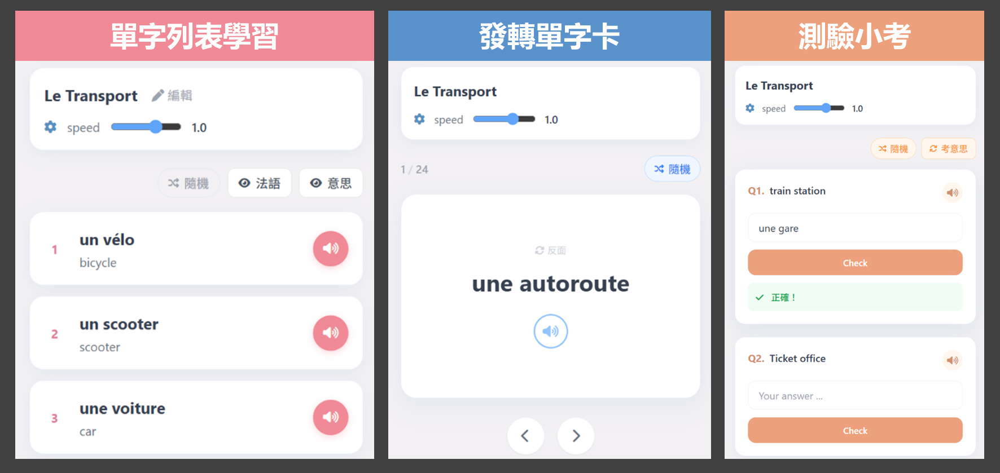

# OH French 法語學習 - GAS 版本

這是一個建構於 **Google Apps Script** 的法語學習應用程式。所有資料儲存在 Google Sheets，不需要獨立的資料庫和伺服器。前端畫面使用 Tailwind CSS 與原生 JavaScript，並整合 Web Speech API 作為內建的語音合成引擎。

## OH French 的特色

1. **零成本部署**：結合 Google Sheets 與 Apps Script Web App。
2. **馬卡龍色系 UI**：採用粉藍、粉橘、粉紅、粉紫的 Tailwind CSS 自訂主題。支援一鍵切換亮暗模式。
3. **語音合成引擎**：整合 Web Speech API，提供語音朗讀功能，增強語言聽讀能力。可調整語速與音調。
4. **三大學習模式**：
   - **瀏覽** (Review)：清單式瀏覽單詞，支援編輯及刪除單字。
   - **卡片** (Flashcards)：翻轉單字卡，用於記憶單字和自我檢測。
   - **考試** (Quiz)：聽讀填空，具備容錯比對（忽略大小寫與標點）。

## 建立自己的 OH French

1. **建立單字表**
   - 前往 Google Drive，建立一個新的 **Google 試算表 (Google Sheets)**。
   - 在選單列點擊 `擴充功能 (Extensions)` > `Apps Script`。

2. **匯入程式碼**
   - 系統會開啟一個新的專案，預設有一個 `Code.gs`。
   - 將本專案中 `gas/Code.gs` 的完整內容複製並貼上覆蓋原有的 `程式碼.gs` (或 `Code.gs`)。
   - 編輯第三行 `const EDIT_PASSWORD = ''`，在引號內填入密碼，例如 `const EDIT_PASSWORD = '123456'`。透過網站編輯單字時需要輸入此密碼做身分驗證。
   - 按下 `Ctrl + S` 儲存。

3. **匯入前端程式碼**
   - 在 Apps Script 編輯器左側的「檔案」區塊，點擊 `+` 號 > `HTML`。
   - 將檔案命名為 **`Index`** (大小寫需完全一致，不要加 .html 副檔名，系統會自己加)。
   - 將本專案中 `gas/Index.html` 的完整內容複製並覆蓋進去。
   - 按下 `Ctrl + S` 儲存。

4. **發佈為網頁應用程式**
   - 點擊右上角藍色按鈕 `部署 (Deploy)` > `新增部署 (New deployment)`。
   - 點擊左側齒輪圖示 ⚙️，選擇 `網頁應用程式 (Web app)`。
   - **說明**: 輸入 `版本1`
   - **身分執行**: 選擇您的帳號 (Me)
   - **誰可以存取**: 選擇 `所有人 (Anyone)`。
   - 點擊 `部署 (Deploy)`。

5. **授權**
   - 第一次執行時，Google 會要求授權權限（因腳本需要讀寫您的試算表）。
   - 點擊 `審查權限` -> 選擇帳號 -> 點擊 `進階` -> `前往... (不安全)` -> 點擊 `允許`。
   - 最後複製畫面上提供的 **網頁應用程式網址 (Web app URL)**，即可開始使用！網址會長這樣：`https://script.google.com/macros/s/AKfycby.../exec`

6. **使用**
   - 首次開啟建議使用電腦網頁，檢查功能是否正常。
   - 手機若有登入多個Google帳戶可能會遭遇權限問題而無法開啟網頁，建議改用無痕模式，或使用Edge等其他瀏覽器開啟。

## 開發與預覽模式 (一般使用者可忽略)

為了方便在部署前預覽畫面與功能，前端程式碼已經內建了「本地模擬模式 (Local Mock Mode)」。

**啟動本地預覽：**
1. 確認您已經安裝 Python。
2. 打開終端機 (Terminal 或 PowerShell)。
3. 切換到 `gas` 資料夾：`cd gas`
4. 啟動內建的 HTTP 伺服器：`python -m http.server 3000`
5. 打開瀏覽器訪問 `http://localhost:3000/Index.html` 即可看到包含模擬資料的 OH French。

